# CapCoach by All Purpose

**Team:** Lievaashini Thanasegaran, Dhanya Gotami, Lee Jian Cheng, Wong Yan Wen  
**Problem Statement:** Lifestyle Track: Beating the Burnout (Stress & Workload Manager)  
**Video Presentation:** \[Unlisted Youtube Link\]  
**Presentation Slides:** \[Public Link\]

### **1\. Project Overview**

**One-Liner:** CapCoach is an automated workload rebalancer that predicts burnout before it hits by calculating your recovery debt against your real-time biodata.

**The Problem:** Academic burnout is a silent epidemic among working university students in Malaysia. Local clinical studies show that 56% of Malaysian undergraduates suffer from severe academic burnout, driven by a staggering 90.1% prevalence of poor sleep quality. This physiological toll is compounded by "work-school conflict." 

Current data reveals that 57.3% of students struggle to balance part-time employment with academic requirements, hitting a critical breaking point when work exceeds 20 hours a week. 

Existing market solutions like *MyPossibleSelf* or standard calendar apps fail these students. They act as passive diaries that treat all time equally, failing to understand that a 6 PM café shift is mathematically inflexible while a reading assignment is flexible—adding cognitive friction to an already exhausted demographic.

**Our Solution:** CapCoach is an automated, proactive burnout intervention engine. It uses local biometric data to predict exhaustion before it happens, and a lightweight, on-device Machine Learning classifier to actively reorganize a working student's schedule when they hit capacity.

**Key Features:**

- **Biometric Capacity Predictor (Health Connect):** Natively syncs with Android Health Connect to measure sleep duration and HRV (Heart Rate Variability), applying a deterministic mathematical penalty to daily task loads to forecast a 90% capacity breach up to 48 hours early.  
    
- **On-Device ML Load Shedder (Frictionless Input):** Automatically triages the student's to-do list using a local Machine Learning Decision Tree. It categorizes tasks into "Keep," "Move," and "Protect" by weighing flexible academic deadlines against inflexible work shifts (using a 20-hour work threshold), with zero cloud latency or hallucination risks.  
    
- **Interactive "Tamagotchi" Mascot & Gamification:** A minimal-typing, visual mascot (Green/Yellow/Red Dino states) that keeps the tool accessible for cognitively fatigued users. It utilizes actionable notifications and an end-of-week gamification loop where visual apple growth (from task completion) allows the Dino to feast, providing a visual sense of accomplishment.  
    
- **Frictionless Schedule Integration:** Natively links with Google Calendar to automatically ingest unmovable commitments (classes and work shifts), reducing data entry friction. The app features a single unified Dashboard tab containing a weekly calendar strip.  
  

### **2\. Ideation & Process**

#### **2.1 Ideas We Considered**

| Idea | Why it was dropped / kept |
| :---- | :---- |
| **A (Chosen): Biometric Prediction \+ ML Triage** | **Kept:** Fulfills the prompt’s specific request for a predictive "load balancer" by actively intervening, moving the app from a passive tracker to an automated system. |
| **B (Chosen): Local-First Database & ML (Room DB / TFLite)** | **Kept:** Health data is highly sensitive. Processing biometric data and running the ML model natively on the device guarantees 100% privacy and zero-latency execution. |
| **C (Dropped): Cloud LLM (Gemini/OpenAI) for Triage** | **Dropped:** Massive privacy risk, requires constant internet, and creates the danger of "hallucinations." We pivoted to a deterministic, offline ML Decision Tree. |
| **D (Dropped): Cloud LLM for Q\&A Conversational Voice Input**  | **Dropped:** NLU (Natural Language Understanding) of Malaysian "Rojak" slang is unfeasible for a local-first build. We pivoted to Voice Input for \*\*Task Title name only\*\*, using native Android Speech-to-Text.  |
| **E (Dropped): General / International Students Only** | **Dropped:** Following mentor advice, this scope lacked specific justification for the features. We pivoted to **Working Undergraduates** because their unmovable work shifts perfectly justify the ML schedule-triage algorithm. |
| **F (Dropped): Reinforcement Learning Model** | **Dropped:** RL suffers from the "cold start" problem and would make terrible suggestions for the first month. A supervised Decision Tree works perfectly from day one. |
| **G (Dropped): Built-In Budget Tracker**  | **Dropped:** Feature creep. This problem is saturated. CapCoach handles Time and Physiological Energy; standard banking apps handle the money.  |

#### **2.2 Ideation Boards**

*Reviewer Note: We utilized google stitch  to rapidly map our logic and user flows.*

- **Ideation diagram:**
 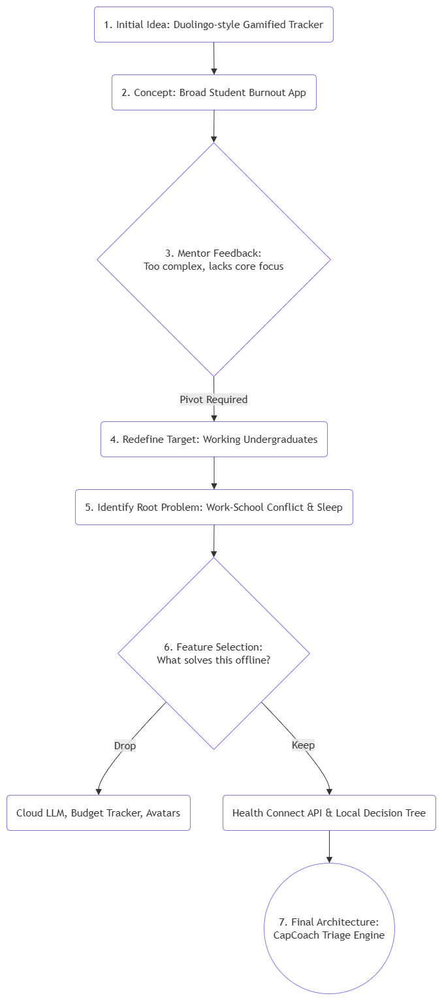

- **User flow diagram:** 
 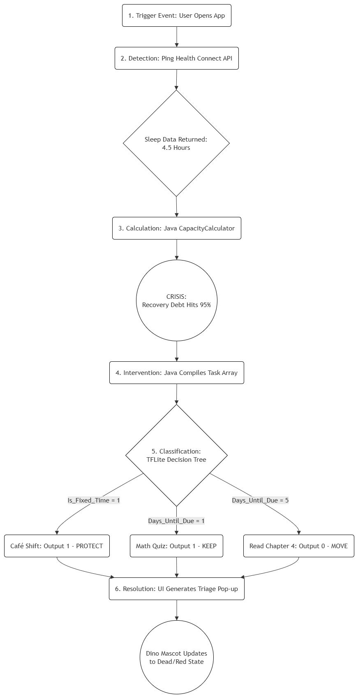

#### **2.3 Mentor Consultation**

| Date | Mentor | Feedback Received | What Was Changed |
| :---- | :---- | :---- | :---- |
| 3 Sept | Sim Hong Bing | Current ui is overwhelming. Focus on judging rubrics. Narrow down user scope. | Simplify first ui draft. Reviewed judging rubrics and focused more on ideation. The target group changed from undergraduate students to international undergraduate students. |
| 6 Sept | Varsha | App lacks a Main Selling Point and relies on supporting features. Needs automation/ML to fulfill the "prediction" aspect of the brief. | **Major Pivot:** Replaced manual sliders with the Biometric Predictor (Health Connect) and built the ML Load Shedder to automate schedule triage. |
| 7 Sept | Varsha | Target user scope (International students) is too niche and doesn't inherently justify the features. | **Pivoted audience:** Broadened to "Working Undergraduates" based on local Malaysian studies highlighting severe work-school conflict. |
| 9 Sept | Marcus Mah Qing Fung | Work on simplifying ui. B2B collaboration with universities needs to be rethought. Focus on solution and impact in video. Increase interactivity between user and mascot. | Minimalized ui design. Focus on current market research instead of B2B proposal. Enhance user engagement by relating task completion with apple growth, where the mascot will consume the apple at the end of the week. |
| 11 Sept | Varsha | Allowed the mentor to review ui. Work on slides and video structure. Have 30s buffer time. If we have time, she advised us to prepare our own slides. | Created slides according to organizers guideline and improve script.  |

### **3\. Design & Prototype**

**UI Prototype:** Please view our prototype through ``index.html`` on phone for best experience. 

Design System:  
fonts (Plus Jakarta Sans, Inter), colors (Primary Blue \#1D70B8, Green \#107C41, Red \#D83B01, Background \#121820). Global App Bar features the Sun/Moon toggle. Bottom Nav is unified into \[Home\], \[+ Add\], \[Settings\].

 Screen 1: Baseline Onboarding
 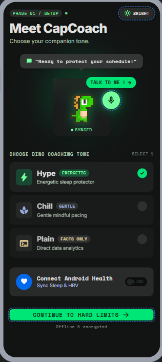  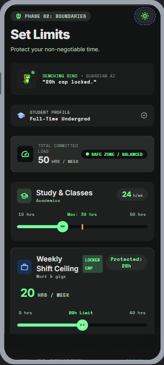

 Screen 2: Unified "Home" Dashboard: 
 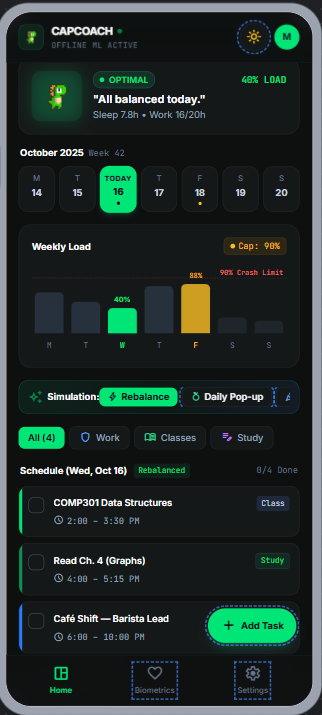  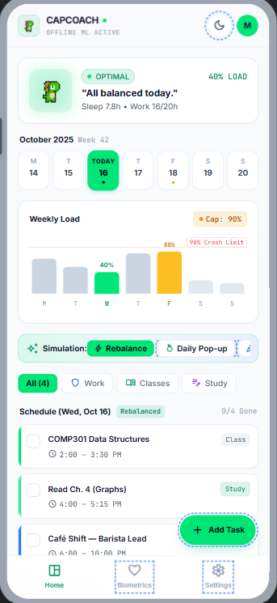  

 Screen 3: Add Activity Modal
 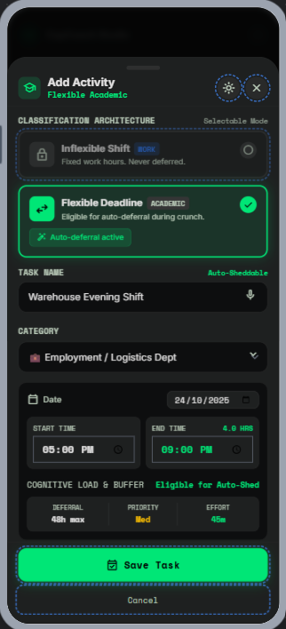 

 Screen 4: Crisis/Warning widget
 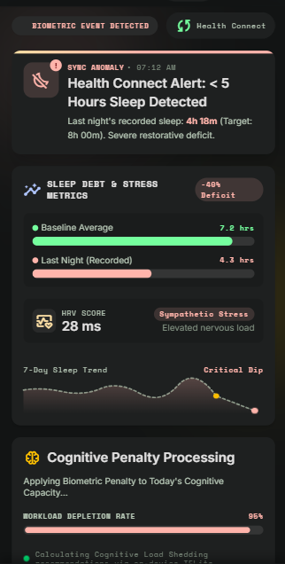   

 Screen 5: Burnout Intervention Pop-up 
 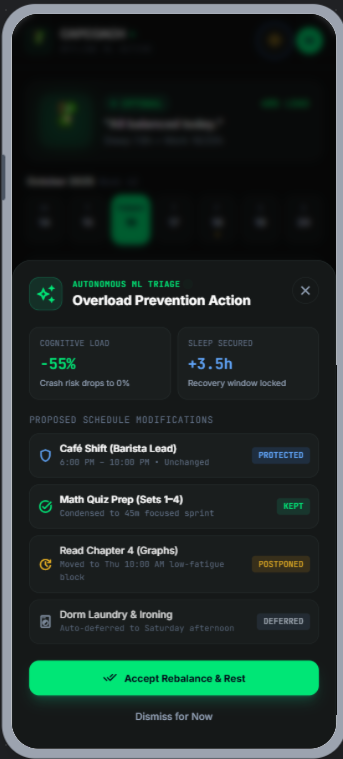

 Screen 6: Interactivity : End-of-week "Feast Modal." The Dino is surrounded by golden apples representing the tasks successfully completed that week, which the Dino consumes. 
 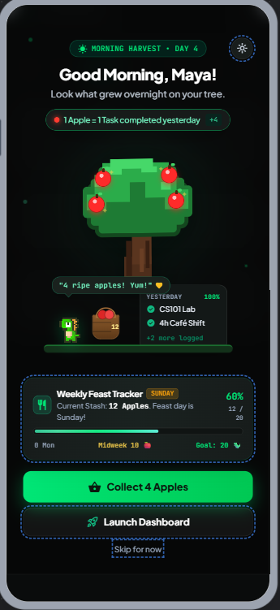  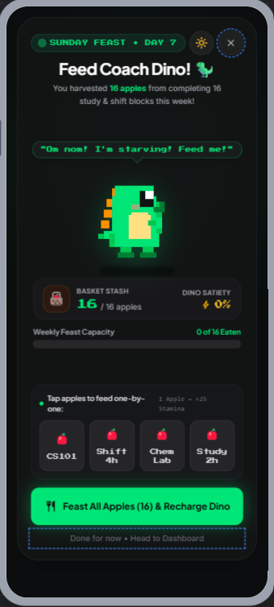 

### **4\. What Makes It Different**

| Feature | The CapCoach Innovation | Differentiation from Current Market |
| :---- | :---- | :---- |
| **Automated Triage (On-Device ML)** | Uses a local Decision Tree to evaluate flexible deadlines against inflexible work shifts to decide what can be safely postponed. | Generic apps force the stressed user to manually reschedule their own calendar. |
| **Biometric Prediction** | Pulls local Sleep Debt via Android Health Connect API to multiply capacity load and predict burnout 48 hours early. | Mental health apps rely entirely on subjective, manual journal entries. |
| **Zero-Cloud Privacy** | Biometric data and task prioritization happen entirely offline using Android Room and TensorFlow Lite. | Competitors often sync sensitive user journal data to centralized cloud servers. |
| **B2B Monetization Model** | Designed as an enterprise wellness tool licensed by Universities to protect working-student retention and social equity. | Most apps use intrusive banner ads, which actively degrade the UX for a stressed student. |
| **Interactivity Layer**  | Empathy-driven visual mascot uses localized slang and an interactive gamification loop (apple feasting) for daily/weekly accomplishment.  | Standard trackers are clinical, robotic, and offer no empathetic connection to a stressed user.  |

### **5\. Technical Architecture & Feasibility**

#### **Tech Stack**

- **Frontend UI:** Android Studio XML. Why: Provides native performance and allows seamless use of Glide for rendering pixel-art GIFs without heavy web-browser overhead. Uses a unified single Home Dashboard fragment.

- **Core Logic:** Native Java. Why: Robust Object-Oriented approach for building the Capacity Calculator math and managing local databases.

- **Local Database:** SQLite / Android Room. Why: Guarantees 100% privacy for biometric data and ensures the app is fully deployable without an internet connection.

- **Machine Learning:** Scikit-Learn (Python) & TensorFlow Lite (Java). Why: We train a highly efficient Decision Tree classification model offline, export it as a tiny .tflite file, and run inference natively on the Android device for zero-latency, hallucination-free triage.

- **Cloud Database (Stretch):** Firebase Realtime DB. Why: Will be used strictly for anonymized B2B university analytics once local features are flawless.

- **API 1:** Google Health Connect (for objective sleep and HRV data).  
- **API 2:** Google Calendar API (for automatic commitment ingestion).

#### **System Architecture Diagram**

 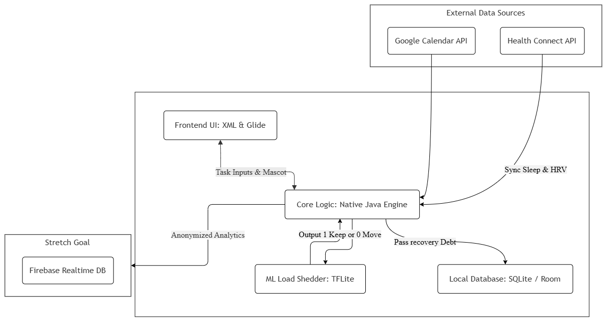

#### **Build Plan & Scope (Sept 21 – Oct 11\)**

To ensure absolute feasibility, we are building a strictly Native Android application, bypassing cross-platform learning curves.

**Week 1 (Sept 21 \- 27):** The Engine & Ingestion. Set up Android Room DB for local storage. Build the CapacityCalculator.java logic. Implement Google Health Connect permissions to read mock/real sleep records. Implement standard XML UI for the onboarding Sliders, Dino Tone, and the 5 structured task category buttons.

**Week 2 (Sept 28 \- Oct 4):** The ML Triage & Voice. Train a supervised Decision Tree classification model in Python based on task constraints (Days Until Due, Is Fixed Time, Category ID, Duration). Export as .tflite, embed it in the Android assets folder, and wire the Java outputs to the intervention XML pop-up layout. Connect native Android SpeechRecognizer to the Task Name input field.

**Week 3 (Oct 5 \- Oct 11):** Polish & Interactivity. Implement the Glide library for visual mascot GIF state-swaps. Finalize the end-of-week Apple Feast Modal pop-up layout. Conduct integration testing to ensure the "90% Overload" trigger perfectly fires the ML triage pop-up. Compile the final .apk for deployment.

### **6\. Market Research & Data References**

**Sleep Quality & Academic Burnout:** 
- 90.1% of Malaysian undergraduates experience poor sleep quality; 56.0% experience academic burnout. 

- Joanne Lim KE, Cheah KJ, Abdul Latif FA, Mohd Shahrin FI. Academic Burnout and Its Association with
Sleep Quality, Physical Activity, and Social Media Addiction Among University Students in Perak, Malaysia:
A Cross-Sectional Study . Makara J Health Res. 2025;29. https://scholarhub.ui.ac.id/cgi/viewcontent.cgi?article=1845&context=mjhr 
  
**Working Student Psychological Strain:** 
- Highlights severe psychological strain and dropout risks for Malaysian working students.  
    
- Yusmariaziani Yusri. (2021). Work-School Conflict, Academic Commitment and Life Satisfaction among Working University Students in Malaysia. Jurnal Psikologi Dan Kesihatan Sosial, 5(1), 8 –. https://doi.org/10.51200/jpks.v8i1.5608 

**The ML Logic Foundation (The 20-Hour Wall):** 
- Proves 57.3% struggle to balance work and school, establishing the \>20-hour work threshold for critical academic strain.

- Saddique , F. (2026). Influence of part-time employment on grade point average and academic outcomes of university students. Social Sciences Spectrum, 5(1), 251–259. https://doi.org/10.71085/sss.05.01.481
